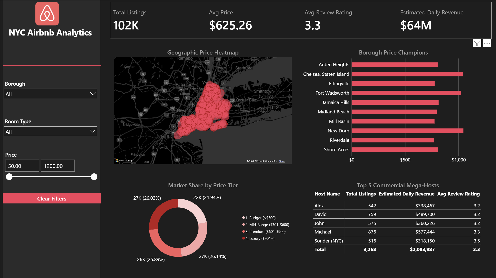
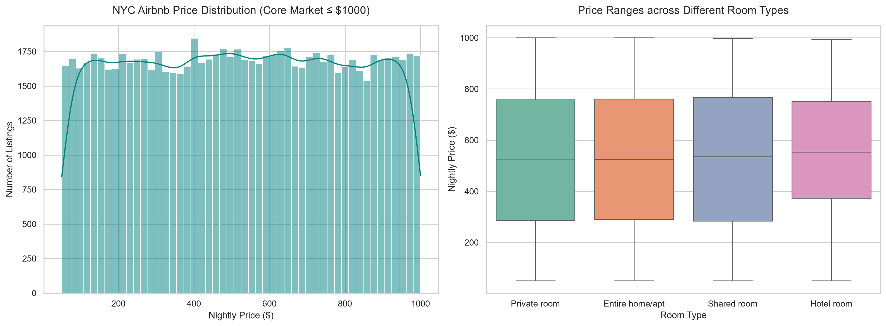
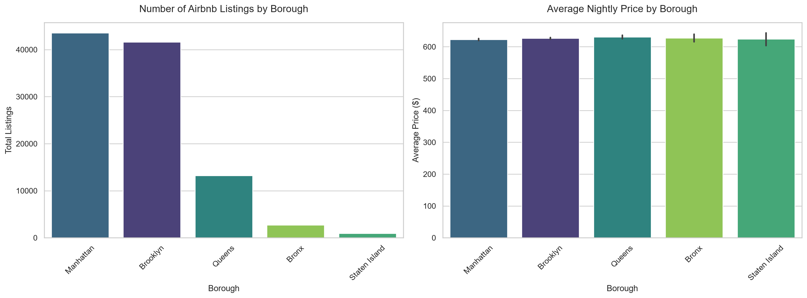
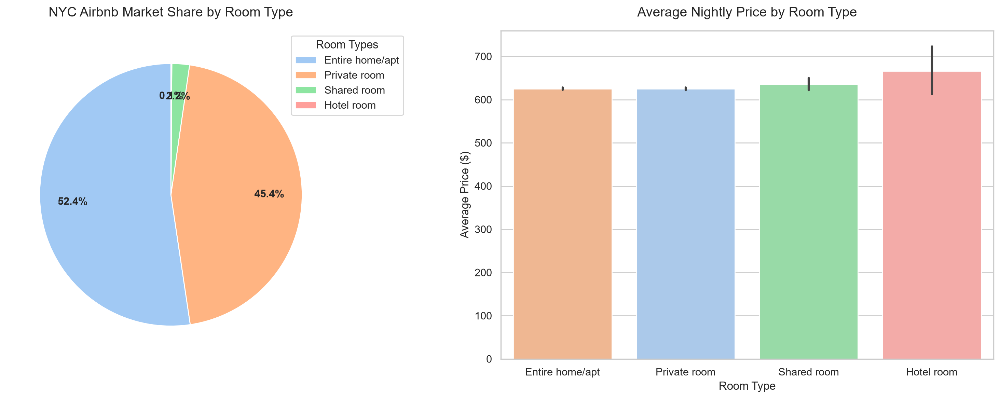
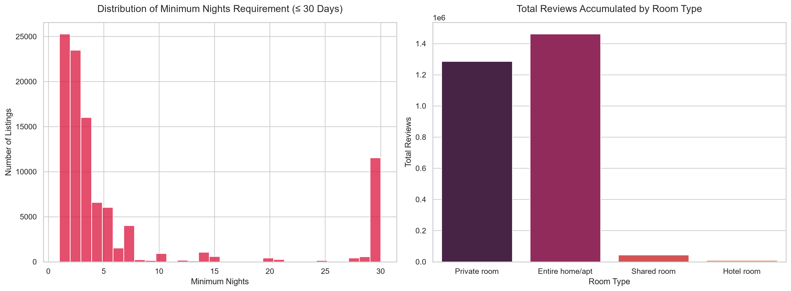

# NYC Airbnb Analytics

> [!TIP]
> **Project Status**: COMPLETE! All data cleaning, SQL analysis, and interactive dashboard creation phases are finished.

## The Final Dashboard

## Overview
This project looks at 102,024 Airbnb listings in New York City to understand pricing, locations, and host details. We use PostgreSQL to store the data and Python to clean it and make charts.

## Tech Stack
- PostgreSQL 18 & DBeaver (for SQL and databases)
- Python 3 with Pandas & Matplotlib (for data cleaning and charts)

## Data Cleaning Steps
- Filled in missing data (like missing reviews) so we didn't have to throw away rows.
- Cleaned up the price columns by removing `$` and commas so the database could read them as numbers.
- Fixed messy text (like mismatched capital letters) in neighborhood names.
- Standardized all the dates to a simple `YYYY-MM-DD` format.

## Exploratory Charts
You can see the code for these in [notebooks/eda.ipynb](notebooks/eda.ipynb). Here are the main takeaways:

1. **Prices & Room Types**: Most listings are affordable (under $200), but hotel rooms are by far the most expensive option.

2. **Boroughs**: Manhattan and Brooklyn have the vast majority of listings, but average prices are actually pretty similar across all boroughs.

3. **What are people renting?**: Entire homes and private rooms make up almost the whole market. 

4. **Booking Habits**: NYC is a short-stay market. Most people require a minimum stay of just a few days.

---

## Business Intelligence Queries

### 1. The Best Neighborhoods to Invest In — [challenge_1_neighbourhood_investment_radar.sql](sql/challenge_1_neighbourhood_investment_radar.sql)

**The Goal**: Find the NYC neighborhoods that charge the highest nightly rates (looking only at areas with at least 100 listings so we know the data is trustworthy).

| rank | neighbourhood | borough | avg\_nightly\_price | total\_listings | avg\_review |
|------|---------------|-----------|-----------|----------------|------------|
| 1 | Gravesend | Brooklyn | 707.46 | 140 | 3.3 |
| 2 | Briarwood | Queens | 700.83 | 121 | 3.5 |
| 3 | Concourse | Bronx | 674.43 | 123 | 3.1 |
| 4 | Longwood | Bronx | 670.97 | 133 | 3.3 |
| 5 | Brownsville | Brooklyn | 670.27 | 153 | 3.5 |
| 6 | East Elmhurst | Queens | 669.22 | 483 | 3.4 |
| 7 | NoHo | Manhattan | 664.96 | 140 | 3.3 |
| 8 | Inwood | Manhattan | 660.65 | 547 | 3.2 |
| 9 | Queens Village | Queens | 660.12 | 145 | 3.2 |
| 10 | Brighton Beach | Brooklyn | 658.40 | 168 | 3.4 |

**What We Learned**:
- Manhattan isn't always the most expensive! Neighborhoods in Brooklyn (Gravesend) and Queens (Briarwood) actually charge more on average.
- The Bronx is a hidden gem. It has two neighborhoods in the top 5, meaning you can likely buy property cheaper there but still charge high rental rates.
- East Elmhurst and Inwood have the most listings in the top 10, meaning they are very active and safe areas to invest in.

**What to do**: If you want to buy a lot of properties safely, look at East Elmhurst and Inwood. If you want to buy cheap property but charge high rent, look at the Bronx or Gravesend.

### 2. Market Segmentation by Price — [challenge_2_price_tier_segmentation.sql](sql/challenge_2_price_tier_segmentation.sql)

**The Goal**: Break the market into 4 price groups (Budget, Mid-Range, Premium, Luxury) to see if paying more gets you better reviews.

| price\_range | market\_share | total\_listings | avg\_price | avg\_review | avg\_min\_nights | avg\_availability |
|-------------|--------------|----------------|-----------|------------|----------------|-----------------|
| Budget | 21.66 | 22,101 | 174.98 | 3.3 | 8.2 | 141.6 |
| Mid-Range | 26.22 | 26,755 | 451.48 | 3.3 | 7.8 | 142.2 |
| Premium | 25.99 | 26,515 | 749.00 | 3.3 | 7.9 | 139.2 |
| Luxury | 26.12 | 26,653 | 1,050.13 | 3.3 | 8.0 | 141.1 |

**What We Learned**:
- The market is split very evenly. About 25% of listings fall into each of the four categories. 
- Paying $1,000 a night gets you the exact same average review score (3.3) as paying $175 a night. Luxury hosts aren't delivering a better guest experience!

**What to do**: Don't just compete on price. Since guests aren't happier at expensive places, a host who focuses on excellent customer service and great amenities can easily steal customers from the "luxury" tier.

### 3. The Top Neighborhoods in Each Borough — [challenge_3_borough_price_champions.sql](sql/challenge_3_borough_price_champions.sql)

**The Goal**: If we want to expand into all 5 boroughs, what are the top 3 most expensive neighborhoods in each one?

| borough | borough\_rank | neighbourhood | avg\_price | total\_listings | avg\_review |
|---------|-------------|---------------|-----------|----------------|------------|
| Bronx | 1 | Throgs Neck | 684.70 | 56 | 3.4 |
| Bronx | 2 | Highbridge | 676.03 | 67 | 3.0 |
| Bronx | 3 | Concourse | 674.43 | 123 | 3.1 |
| Brooklyn | 1 | Columbia St | 712.23 | 88 | 3.4 |
| Brooklyn | 2 | Gravesend | 707.46 | 140 | 3.3 |
| Brooklyn | 3 | Coney Island | 695.26 | 50 | 3.1 |
| Manhattan | 1 | Stuyvesant Town | 680.92 | 83 | 3.2 |
| Manhattan | 2 | NoHo | 664.96 | 140 | 3.3 |
| Manhattan | 3 | Inwood | 660.65 | 547 | 3.2 |
| Queens | 1 | Briarwood | 700.83 | 121 | 3.5 |
| Queens | 2 | Kew Gardens Hills | 690.39 | 66 | 3.3 |
| Queens | 3 | Cambria Heights | 686.49 | 78 | 3.3 |
| Staten Island | 1 | Stapleton | 699.23 | 64 | 3.7 |
| Staten Island | 2 | St. George | 651.93 | 125 | 3.4 |
| Staten Island | 3 | West Brighton | 638.02 | 59 | 3.0 |

**What We Learned**:
- Columbia St in Brooklyn ($712) is the most expensive neighborhood in the whole city, beating all of Manhattan.
- Staten Island's Stapleton area has the highest guest satisfaction score (3.7) while still charging near the top prices. It's a hidden gem!

**What to do**: Look at expanding into Columbia St (Brooklyn) and Throgs Neck (Bronx) where you can charge high prices without fighting all the competition in Manhattan. Stapleton (Staten Island) is also great for happy guests.

### 4. The Mega-Hosts — [challenge_4_commercial_host_syndicate.sql](sql/challenge_4_commercial_host_syndicate.sql)

**The Goal**: Who are the biggest "Mega-Hosts" in NYC, and how much money are they making? (The city often fines or shuts down these massive hotel-style operations).

| rank | host\_name | total\_listings | boroughs\_operated\_in | avg\_price | estimated\_daily\_revenue |
|------|-----------|-----------------|----------------------|-----------|-------------------------|
| 1 | Michael | 878 | 5 | 658.98 | $578,584.00 |
| 2 | David | 761 | 5 | 645.12 | $490,934.00 |
| 3 | John | 576 | 5 | 626.38 | $360,793.00 |
| 4 | Alex | 543 | 5 | 623.45 | $338,534.00 |
| 5 | Sonder (NYC) | 516 | 2 | 616.57 | $318,150.00 |

**What We Learned**:
- The top hosts aren't regular people renting a spare room; they are massive companies. The top host manages nearly 900 properties and could make over half a million dollars *in a single night*.
- The top 4 mega-hosts have properties spread out across all 5 boroughs. 
- "Sonder (NYC)" is a known corporate hospitality company.

**What to do**: If you are buying an apartment building, check if these mega-hosts operate heavily in it. If the city shuts them down, the building could suddenly have dozens of empty units, which hurts property values. 

---

## Progress Checklist
- [x] Set up database and load data
- [x] Clean and fix messy data using Python
- [x] Make basic charts to understand the market
- [x] Answer 4 advanced business questions using SQL
- [x] Build an interactive Power BI dashboard
